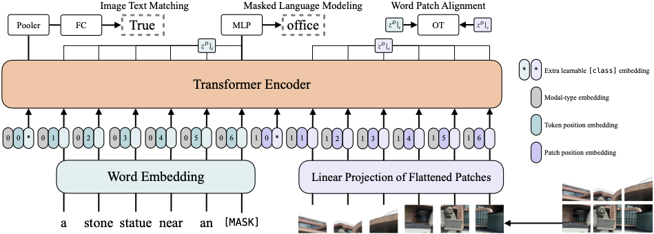

# Robust Multimodal Contrastive Learning

## Introduction 
PyTorch Lightning code for the paper "RMCL: Robust Multimodal Contrastive Learning". Slides of our xxx talk are avialable here.

---
<p align="center">
  
</p>

## Install
```bash
pip install -r requirements.txt
pip install -e .
```

## Download Pretrained Weights
We provide five pretrained weights
1. ViLT-B/32 Pretrained with MLM+ITM for 200k steps on GCC+SBU+COCO+VG (ViLT-B/32 200k) [link](https://github.com/dandelin/ViLT/releases/download/200k/vilt_200k_mlm_itm.ckpt)
2. ViLT-B/32 200k finetuned on VQAv2 [link](https://github.com/dandelin/ViLT/releases/download/200k/vilt_vqa.ckpt)
3. ViLT-B/32 200k finetuned on NLVR2 [link](https://github.com/dandelin/ViLT/releases/download/200k/vilt_nlvr2.ckpt)
4. ViLT-B/32 200k finetuned on COCO IR/TR [link](https://github.com/dandelin/ViLT/releases/download/200k/vilt_irtr_coco.ckpt)
5. ViLT-B/32 200k finetuned on F30K IR/TR [link](https://github.com/dandelin/ViLT/releases/download/200k/vilt_irtr_f30k.ckpt)

## Download counter-fitting word embeddings.
The synonym selection for the Geometric based attack is computed from the cosine similarity scores between word pairs based on the counter-fitting word embeddings [link](https://drive.google.com/open?id=1bayGomljWb6HeYDMTDKXrh0HackKtSlx)

## Dataset Preparation (Pretraining/Finetuning)
See [`DATA.md`](DATA.md)

## Train New Models (Pretraining/Finetuning)
See [`TRAIN.md`](TRAIN.md)

## Evaluation
See [`EVAL.md`](EVAL.md)

## Citation
If you use any part of this code and pretrained weights for your own purpose, please cite our [paper]

## Contact for Issues

